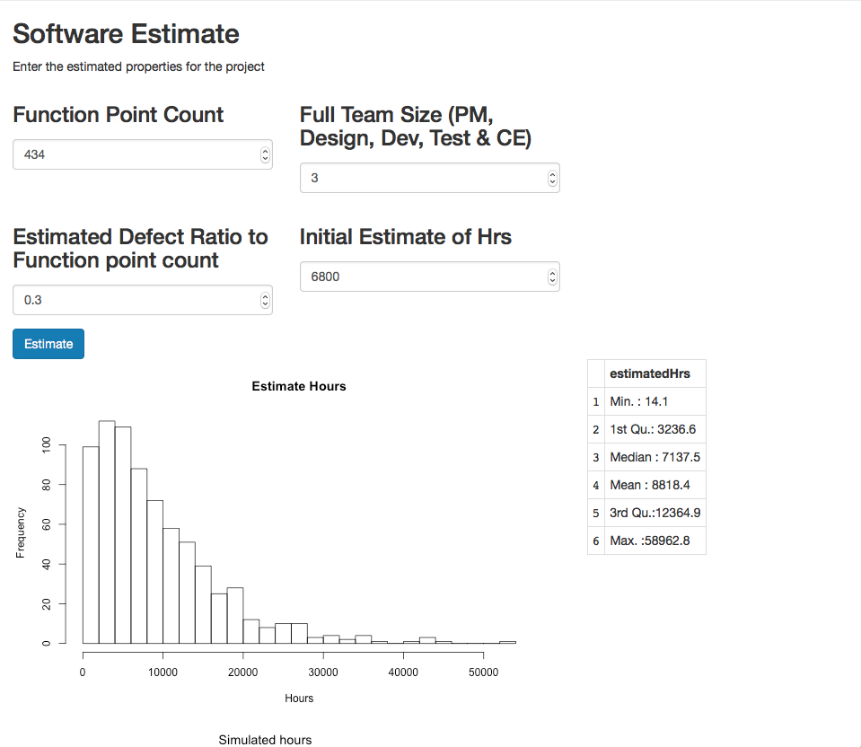

## Estimation of Software Project Duration with Bayesian linear regression

This project provides an example of using Bayesian linear regression to estimate 
duration of project hours based on the features of functionPoints, teamSize, totalDefects and estimatedHrs.

The purpose is to demonstrate the use of the bayesian regression technique for multivariate data.

The page [Estimation](estimation.pdf) provides a discussion of the technique and background notes on the source data.

The ShinyR UI provides a demonstration of applying the input values defined in the model to execute 
a number of simulations in order to produce a distribution of potential estimates for the target variable.
The distribution of the target variable is summarised and its histogram is plotted in order to provide an
indication as to the likely values for the project hours based on the model.

Note that the attributes available as input features are derived due to the limited availability of data
for this example, however where additional attributes are available, it is certainly possible to
generate a new model to suite the extended attributes. Additionally, the domain of software project duration
estimation serves only as an example of the application for the technique. The method can be extended to model predictors for other kinds of data sets and can be extended to perform logistic regression for binary classification if required. This repository provides a working prototype of the method, and explanation of the approach.



The model can be generated using the R script "setup_and_train.R" and the initial data set can be updated with
additional samples, should they be made available.

The link to [Estimation](estimation.pdf) also discusses approaches to using the bayes update rules when new observations are available.

The server.R program can be run using the R command:

```
runApp('estimation')
```

Note that it loads the model file from the sibling directory "data".
